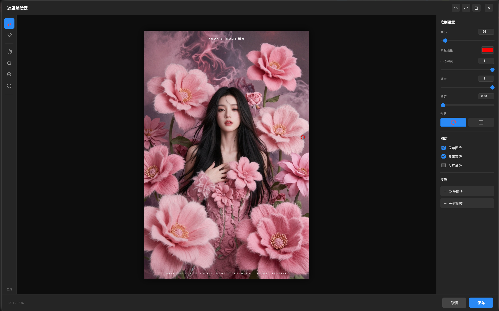
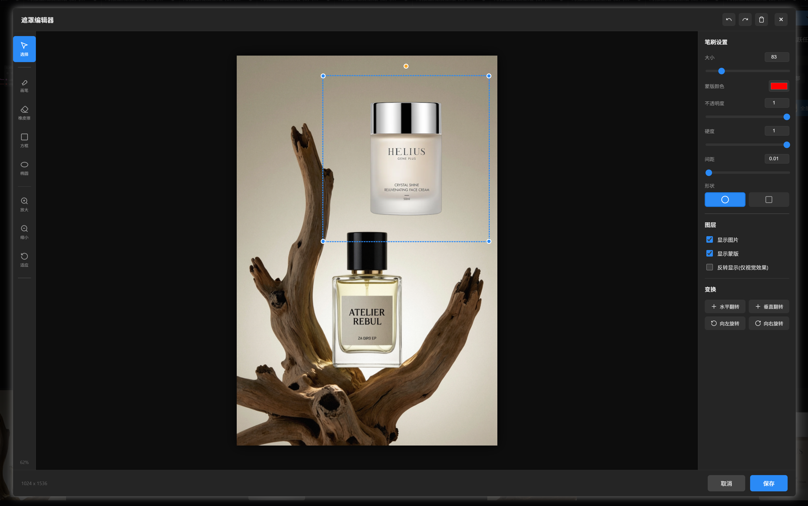
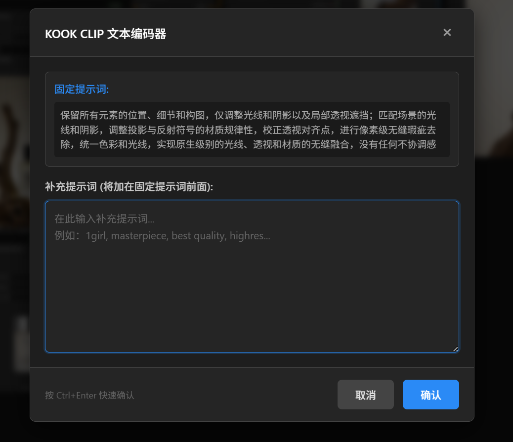

# KOOK 交互式节点包

一个功能强大的 ComfyUI 自定义节点包，提供交互式图像蒙版编辑和文本编码功能。节点会在工作流执行时弹出可视化编辑器，让用户能够直观地输入数据。

## 包含节点

### 1. KOOK_图像蒙版编辑 (KOOKImageMaskEditing)

提供交互式图像蒙版编辑功能，支持画笔、橡皮擦、框选等工具。
- 
- 
#### 功能特性

- **工作流阻塞执行** - 节点会暂停工作流，直到用户完成编辑并点击确认/取消
- **实时蒙版绘制** - 支持画笔和橡皮擦工具自由绘制蒙版
- **框选工具** - 支持矩形和椭圆框选快速创建蒙版
- **可视化编辑界面** - 美观的弹窗界面，支持图片缩放、平移等操作
- **多进程兼容** - 支持云端平台等多进程环境
- **颜色层显示** - 蒙版区域以半透明颜色层显示，直观查看选中区域

#### 绘制工具

- **画笔工具 (B)** - 绘制蒙版区域
- **橡皮擦工具 (E)** - 擦除蒙版区域
- **方框选区 (R)** - 矩形框选，按住 SHIFT 等比例正方形
- **椭圆选区 (O)** - 椭圆框选，按住 SHIFT 等比例正圆
- **移动工具 (H/空格)** - 拖拽平移画布

#### 笔刷设置

- **大小** - 调整笔刷尺寸 (1-500)，默认 24
- **蒙版颜色** - 自定义蒙版显示颜色，默认红色
- **不透明度** - 控制绘制透明度 (0-1)，默认 1
- **硬度** - 调整笔刷边缘硬度 (0-1)，默认 1
- **间距** - 控制绘制点之间的间距 (0.01-5)，默认 0.01
- **形状** - 圆形或方形笔刷

#### 变换操作

- **水平翻转** - 水平翻转图片和蒙版
- **垂直翻转** - 垂直翻转图片和蒙版
- **向左旋转** - 逆时针旋转 90 度
- **向右旋转** - 顺时针旋转 90 度

#### 叠加图像功能

支持第二个图像输入，可将用户提供的图像叠加到底层图像上进行编辑：

- **可选输入** - `overlay_image` 为可选输入，不连接时不影响正常使用
- **独立控制** - 叠加图像可独立调整位置、缩放和旋转
- **实时预览** - 所有变换操作实时显示在编辑器中
- **灵活编辑** - 可显示/隐藏叠加图像，方便对比编辑

**叠加图像控制：**
- **位置 X/Y** - 调整叠加图像的水平和垂直位置 (-2000 到 2000)
- **缩放** - 调整叠加图像大小 (0.1x 到 5x)
- **旋转** - 旋转叠加图像 (-360° 到 360°)
- **重置位置** - 一键重置所有变换参数
- **居中** - 将叠加图像居中到底层图像

#### 历史记录

- **撤销 (Ctrl+Z)** - 撤销上一步操作
- **重做 (Ctrl+Y / Ctrl+Shift+Z)** - 重做操作
- **清除蒙版** - 清空所有绘制内容

#### 输入输出

| 参数名 | 类型  | 说明         |
| ------ | ----- | ------------ |
| image  | IMAGE | 输入图像张量（底层图像） |
| overlay_image (可选) | IMAGE | 叠加图像（将显示在最上层） |
| 反转蒙版 | BOOLEAN | 反转蒙版输出，黑色=重绘区域 |

| 参数名 | 类型  | 说明                    |
| ------ | ----- | ----------------------- |
| 原图   | IMAGE | 原始输入图像            |
| 蒙版   | MASK  | 用户绘制的蒙版 (白色为选中区域) |

**蒙版方向说明：**
- 默认情况下，白色区域表示要重绘的区域
- 如果下游节点需要黑色作为重绘区域，请启用"反转蒙版"选项

---

### 2. KOOK_CLIP文本编码器 (KOOKCLIPTextEditor)

提供交互式文本输入功能，支持阻塞运行等待用户输入提示词。内置固定提示词，专注于图像融合和光线调整。
- 
#### 功能特性

- **工作流阻塞执行** - 节点会暂停工作流，直到用户输入文本并点击确认
- **弹出式文本编辑器** - 美观的弹窗界面，支持多行文本输入
- **内置固定提示词** - 自动附加专业的图像融合提示词，优化光线、阴影和透视效果
- **CLIP编码** - 自动将输入文本编码为CONDITIONING，兼容多种CLIP模型
- **多进程兼容** - 支持云端平台等多进程环境

#### 内置固定提示词

节点会自动将以下固定提示词附加到用户输入的提示词后面：

```
保留所有元素的位置、细节和构图，仅调整光线和阴影以及局部透视遮挡；匹配场景的光线和阴影，调整投影与反射符号的材质规律性，校正透视对齐点，进行像素级无缝瑕疵去除，统一色彩和光线，实现原生级别的光线、透视和材质的无缝融合，没有任何不协调感
```

**使用方式：**
- 在弹窗中输入主体描述（如：红色香水瓶、金色手表等）
- 节点会自动将主体描述与固定提示词合并
- 最终提示词格式：`主体描述, 固定提示词`

#### 快捷键

- **Ctrl + Enter** - 快速确认
- **ESC** - 取消并关闭窗口

#### 输入输出

| 参数名 | 类型  | 说明         |
| ------ | ----- | ------------ |
| clip   | CLIP  | CLIP模型     |
| 依赖 (可选) | * | 依赖输入，用于控制执行顺序 |

| 参数名 | 类型         | 说明                    |
| ------ | ------------ | ----------------------- |
| 条件   | CONDITIONING | 编码后的文本条件        |
| 文本   | STRING       | 合并后的完整提示词      |

**使用说明：**
- 节点上没有文本输入框，运行时会弹出窗口输入
- 弹窗会显示内置的固定提示词供参考
- 支持 Flux、SDXL、SD1.5 等多种模型的 CLIP 编码

---

### 3. KOOK_图片保存 (KOOKImageSave)

保存图像到输出目录，同时输出图像供下游节点使用。

#### 功能特性

- **保存并输出** - 保存图像的同时输出图像张量，可连接下游节点
- **自动命名** - 支持自定义文件名前缀，自动添加序号
- **元数据保存** - 保存工作流提示词等元数据到PNG
- **图像缓存** - 支持忽略上游节点，直接输出已保存的图像

#### 输入输出

| 参数名          | 类型   | 说明                     |
| --------------- | ------ | ------------------------ |
| images          | IMAGE  | 输入图像张量             |
| filename_prefix | STRING | 文件名前缀，默认ComfyUI  |

| 参数名 | 类型  | 说明             |
| ------ | ----- | ---------------- |
| 图像   | IMAGE | 输出图像张量     |

---

## 安装方法

### 方式一：手动安装

1. 将 `KOOK_Image_Mask_Editing` 文件夹复制到 ComfyUI 的 `custom_nodes` 目录
2. 重启 ComfyUI

### 方式二：ComfyUI-Manager

1. 打开 ComfyUI-Manager
2. 点击 "Install Custom Nodes"
3. 搜索 "KOOK\_Image\_Mask\_Editing" 并安装

---

## 使用方法

### 图像蒙版编辑节点

1. 在工作流中添加 **KOOK\_图像蒙版编辑** 节点（位于 `KOOK` 分类下）
2. 将上游图像节点连接到本节点的 `image` 输入端
3. 运行工作流，节点会自动弹出蒙版编辑器
4. 使用画笔工具绘制蒙版区域，或使用框选工具快速创建选区
5. 点击"保存"确认，或点击"取消"放弃编辑

**右键菜单功能：**
- 右键点击节点可选择 **"🎨 打开遮罩编辑器"** 重新编辑蒙版（无需重新运行前面节点）
- 选择 **"🗑️ 清除蒙版"** 清除已保存的蒙版

**图片拖拽：**
- 按住鼠标中键拖拽图片
- 或按住 Alt + 鼠标左键拖拽
- 或按住 Ctrl + 鼠标左键拖拽

**蒙版颜色显示：**
- 绘制的蒙版区域会以半透明颜色层显示（默认红色）
- 颜色层位于蒙版之上，可以直观看到选中区域
- 蒙版颜色仅影响显示，不影响实际输出的蒙版数据

### CLIP文本编码器节点

1. 在工作流中添加 **KOOK\_CLIP文本编码器** 节点（位于 `KOOK` 分类下）
2. 将CLIP模型连接到本节点的 `clip` 输入端
3. 可选：将上游节点连接到 `依赖` 输入端以控制执行顺序
4. 运行工作流，节点会自动弹出文本输入窗口
5. 输入提示词后点击"确认"，或点击"取消"/关闭窗口
6. 节点输出编码后的CONDITIONING和原始文本

**注意：** 节点上没有文本输入框，所有文本输入都在弹窗中进行。确认后文本会显示在节点的文本展示区域中。

### 图片保存节点

1. 在工作流中添加 **KOOK\_图片保存** 节点（位于 `KOOK` 分类下）
2. 将VAE解码后的图像连接到本节点的 `images` 输入端
3. 可选：设置 `filename_prefix` 自定义文件名前缀
4. 节点的 `图像` 输出可以连接到遮罩编辑器等下游节点
5. 图像会自动保存到 ComfyUI 的输出目录

**典型工作流示例：**
```
VAE解码 → KOOK_图片保存 → KOOK_图像蒙版编辑 → 后续处理
```
这样可以在保存图片的同时，继续使用遮罩编辑器处理图像，无需等待重新生成。

---

## 快捷键汇总

### 图像蒙版编辑节点

| 快捷键           | 功能             |
| ---------------- | ---------------- |
| B                | 切换到画笔工具   |
| E                | 切换到橡皮擦工具 |
| R                | 切换到方框选区   |
| O                | 切换到椭圆选区   |
| H / 空格         | 切换到移动工具   |
| Ctrl + Z         | 撤销             |
| Ctrl + Y         | 重做             |
| Ctrl + Shift + Z | 重做             |
| Esc              | 关闭编辑器（取消）|
| Alt + 拖拽       | 平移画布         |
| 滚轮             | 缩放画布         |
| SHIFT + 拖拽选区 | 等比例缩放选区   |

### CLIP文本编码器节点

| 快捷键           | 功能             |
| ---------------- | ---------------- |
| Ctrl + Enter     | 确认并继续       |
| Esc              | 取消并关闭       |

---

## 云端平台使用说明

本节点包支持在云端平台（如 AutoDL、恒源云等）上运行，针对多进程环境进行了优化：

1. **文件系统通信** - 使用文件系统而非内存进行前后端通信，确保多进程环境下数据同步
2. **会话ID机制** - 每次编辑生成唯一的会话ID，避免进程间数据冲突
3. **HTTP轮询备用** - WebSocket 不可用时自动切换到 HTTP 轮询模式

**注意事项：**
- 云端平台可能需要更长的等待时间，请耐心等待弹窗出现
- 如果弹窗未出现，请检查浏览器控制台日志
- 确保云端平台的防火墙允许 WebSocket 连接

---

## 文件结构

```
KOOK_Image_Mask_Editing/
├── __init__.py                   # 节点注册和配置
├── py/
│   ├── mask_editor_node.py       # 图像蒙版编辑节点
│   ├── clip_text_editor_node.py  # CLIP文本编码器节点
│   └── image_save_node.py        # 图片保存节点
├── web/
│   ├── kook_mask_editor.js       # 蒙版编辑器前端代码
│   └── kook_clip_text_editor.js  # 文本编码器前端代码
└── README.md                     # 本文件
```

---

## 技术说明

### 后端实现

- 使用文件系统同步实现工作流阻塞（支持多进程环境）
- 通过 `PromptServer` WebSocket 与前端进行实时通信
- 支持 HTTP API 作为 WebSocket 的备用通信方式
- 支持 base64 图像数据传输
- 支持 CLIP 模型编码（兼容 Flux、SDXL、SD1.5 等）
- 使用会话ID确保多进程环境下的数据隔离

### 前端实现

- 基于 HTML5 Canvas 的绘制引擎（蒙版编辑器）
- 使用 CSS3 实现现代化 UI 界面
- 支持响应式布局和触摸操作
- 支持键盘快捷键
- 使用颜色层 canvas 实现蒙版颜色显示（半透明叠加）

---

## 注意事项

1. **工作流阻塞** - 节点会阻塞工作流执行直到用户交互完成，请确保在需要时及时关闭编辑器
2. **浏览器兼容性** - 推荐使用 Chrome、Firefox、Edge 等现代浏览器
3. **大图像处理** - 超大图像可能会影响编辑性能，建议先进行适当缩放
4. **云端平台** - 在云端平台使用时，请确保有足够的磁盘空间用于临时文件存储

---

## 常见问题

**Q: 弹窗没有出现怎么办？**
A: 请检查浏览器控制台日志，查看是否有错误信息。云端平台可能需要更长的等待时间。

**Q: 蒙版颜色显示不正确怎么办？**
A: 蒙版颜色仅用于显示，不影响实际的蒙版输出。实际蒙版数据始终是白色（选中区域）。颜色层以半透明方式叠加显示。

**Q: 点击保存后弹窗没有关闭？**
A: 请检查网络连接，确保前端能够成功发送请求到后端。查看浏览器控制台是否有错误日志。

**Q: 云端平台上蒙版没有生效？**
A: 请确保使用的是最新版本，旧版本可能不支持多进程环境。更新后重启 ComfyUI。

---

## 更新日志

### v1.6.0

- 新增叠加图像功能，支持第二个图像输入
- 叠加图像可独立调整位置、缩放和旋转
- 叠加图像为可选输入，不连接时不影响正常使用
- 添加叠加图像控制面板，实时预览变换效果
- 支持显示/隐藏叠加图像，方便对比编辑

### v1.5.0

- 优化多进程环境兼容性，支持云端平台
- 使用文件系统替代内存存储，确保多进程间数据同步
- 添加会话ID机制，避免进程间数据冲突
- 添加 HTTP API 作为 WebSocket 的备用通信方式
- 优化蒙版颜色显示，使用颜色层 canvas 实现半透明叠加
- 修复弹窗关闭问题
- 优化调试日志输出

### v1.4.0

- 优化 CLIP 文本编码器阻塞机制，与蒙版编辑器一致
- 为 CLIP 文本编码器添加依赖输入端口，支持控制执行顺序
- 为 CLIP 文本编码器添加文本显示区域，确认后显示输入内容
- 为图像蒙版编辑节点添加反转蒙版选项
- 支持多种图片拖拽方式（中键、Alt+左键、Ctrl+左键）
- 移除图像蒙版编辑节点的抓手工具图标
- 添加更多调试日志帮助诊断问题

### v1.3.0

- 新增 KOOK_图片保存 节点
- 支持保存图像的同时输出供下游使用
- 为 KOOK_图像蒙版编辑 节点添加右键菜单功能
- 支持右键重新打开编辑器修改蒙版

### v1.2.0

- 新增 KOOK_CLIP文本编码器 节点
- 支持交互式文本输入和CLIP编码

### v1.1.0

- 新增方框选区和椭圆选区工具
- 新增向左/向右旋转功能
- 优化默认参数设置
- 支持 SHIFT 键等比例缩放选区

### v1.0.0

- 初始版本发布
- 实现基本的蒙版绘制功能
- 支持画笔、橡皮擦、撤销/重做等功能
- 支持水平/垂直翻转
- 支持自定义蒙版颜色

---

## 许可证

MIT License

## 作者

KOOK
